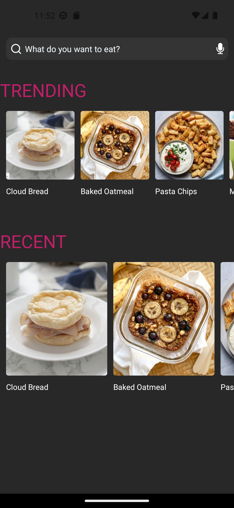

# Recipe app

This repository contains the mobile application project for Team B Recipe App, developed with React Native as part of the training program at BrightCoders Institute.

# Table of content
 - [Description](#project-description)
 - [Technologies used](#technologies-used)
 - [Screenshots](#screenshots)
 - [Development environment setup](#development-environment-setup)
 - [Badges](#badges)

## Project Description

Recipe App is a mobile application developed with React Native that provides a user-friendly platform for discovering, exploring, and cooking a wide variety of recipes. With a curated feed of recent and popular recipes, a powerful search feature, and detailed recipe pages showcasing serving portions and ingredients
## Technologies Used

- [React Native](https://reactnative.dev): Framework for mobile application development.
- [Expo](https://expo.dev): Platform for developing and deploying React Native applications.
- [JavaScript](https://developer.mozilla.org/en-US/docs/Web/JavaScript): Programming language used.
- Other React Native-specific packages and dependencies detailed in the `package.json` file.

### Features

 - Recipe Feed: Explore a curated selection of recent and popular recipes.
 - Recipe Details: View detailed information for each recipe, including servings, ingredients, cooking instructions, and attractive photos.
 - Intuitive Interface: Enjoy an elegant and user-friendly interface while browsing and accessing recipe details.
 - Horizontal List Scroll: Browse recipes horizontally to see more options in each category.
 - Interactive Detail Page: Select a recipe to open an interactive detail page with comprehensive and appealing information.

## Screenshots 




## Development Environment Setup

Follow these steps to set up the development environment locally:

1. Clone this repository to your local machine:
   ```
   git clone https://github.com/BrightCoders-Institute/reto-recetario-de-cocina-team-b
   ```

2. Ensure that you have Node.js installed on your system. Refer to the official documentation for detailed instructions on the installation.

3. Install the project dependencies by running the following command in the project's root directory:
   ```
   npm install
   ```

4. Start the application on your device/emulator using Expo:
   ```
   npm start
   ```

5. Scan the generated QR code with the Expo Go app on your mobile device or use an emulator to test the application.


## Credits

 - [arturovaldez019](https://github.com/arturovaldez019)
 - [BrandonVG](https://github.com/BrandonVG)
 - [DerekAyala](https://github.com/DerekAyala)
 - [Tole15](https://github.com/Tole15)
 - [FebernalGober](https://github.com/FebernalGober)


## Badges

### Codeclimate qualification badge
<a href="https://codeclimate.com/github/BrightCoders-Institute/reto-recetario-de-cocina-team-b/maintainability"></a>

## Contribution

If you want to contribute to this project, follow these steps:

1. Fork this repository and clone it to your local machine.

2. Create a new branch for your contribution:
   ```
   git checkout -b feature/new-feature
   ```

3. Make your modifications and improvements.

4. Make sure to run the existing tests and add new tests for your changes.

5. Commit your changes:
   ```
   git commit -m "Add new feature"
   ```

6. Push your changes to your remote repository:
   ```
   git push origin feature/new-feature
   ```

7. Create a pull request in this repository and describe your changes in detail.

The development team will review your request and provide feedback as soon as possible.

## Contact

If you have any questions or suggestions regarding the project, feel free to visit our collaboration space on Gather.town: [Campus Zeffo ](https://app.gather.town/app/Xqjd4OwO4fzoQAHV/campus-zeffo).