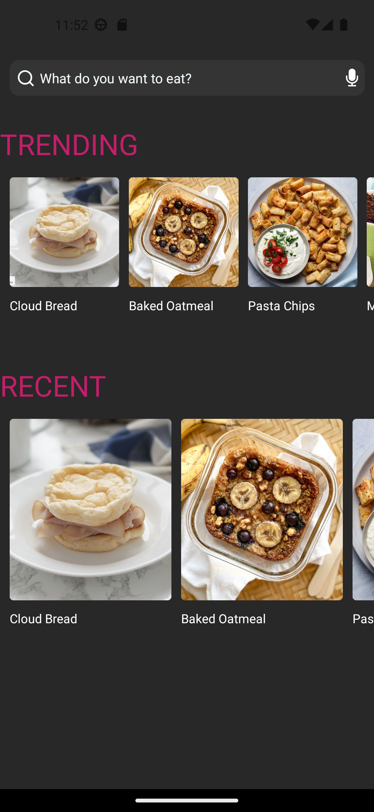
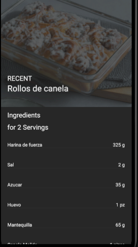
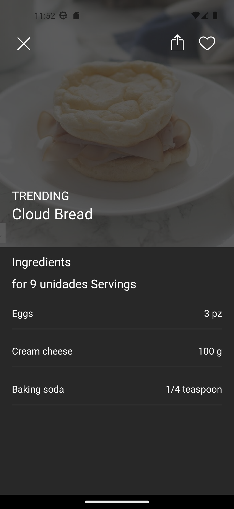
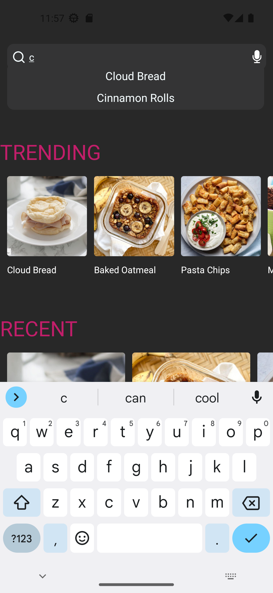

```

# Aplicación de Recetas
Este repositorio contiene el proyecto de aplicación móvil para el Equipo B de la Aplicación de Recetas, desarrollado con React Native como parte del programa de entrenamiento en el Instituto BrightCoders.
# Tabla de contenido
 - [Descripción](#descripción-del-proyecto)
 - [Tecnologías utilizadas](#tecnologías-utilizadas)
 - [Capturas de pantalla](#capturas-de-pantalla)
 - [Configuración del entorno de desarrollo](#configuración-del-entorno-de-desarrollo)
 - [Insignias](#insignias)
## Descripción del proyecto
La Aplicación de Recetas es una aplicación móvil desarrollada con React Native que proporciona una plataforma amigable para descubrir, explorar y cocinar una amplia variedad de recetas. Con una selección curada de recetas recientes y populares, una poderosa función de búsqueda y páginas detalladas de recetas que muestran porciones y ingredientes.
## Tecnologías utilizadas
- [React Native](https://reactnative.dev): Framework para el desarrollo de aplicaciones móviles.
- [Expo](https://expo.dev): Plataforma para desarrollar e implementar aplicaciones de React Native.
- [JavaScript](https://developer.mozilla.org/en-US/docs/Web/JavaScript): Lenguaje de programación utilizado.
- Otros paquetes y dependencias específicos de React Native detallados en el archivo `package.json`.
### Características
 - Feed de recetas: Explora una selección curada de recetas recientes y populares.
 - Detalles de receta: Ver información detallada de cada receta, incluyendo porciones, ingredientes, instrucciones de cocción y fotos atractivas.
 - Interfaz intuitiva: Disfruta de una interfaz elegante y fácil de usar al navegar y acceder a los detalles de las recetas.
 - Desplazamiento de lista horizontal: Explora las recetas horizontalmente para ver más opciones en cada categoría.
 - Página de detalles interactiva: Selecciona una receta para abrir una página de detalles interactiva con información completa y atractiva.
## Capturas de pantalla




## Configuración del entorno de desarrollo
Sigue estos pasos para configurar el entorno de desarrollo localmente:
1. Clona este repositorio en tu máquina local:
   ```
   git clone https://github.com/BrightCoders-Institute/reto-recetario-de-cocina-team-b
   ```
2. Asegúrate de tener Node.js instalado en tu sistema. Consulta la documentación oficial para obtener instrucciones detalladas sobre la instalación.
3. Instala las dependencias del proyecto ejecutando el siguiente comando en el directorio raíz del proyecto:
   ```
   npm install
   ```
4. Inicia la aplicación en tu dispositivo/emulador utilizando Expo:
   ```
   npm start
   ```
5. Escanea el código QR generado con la aplicación Expo Go en tu dispositivo móvil o utiliza un emulador para probar la aplicación.
## Créditos
 - [arturovaldez
019](https://github.com/arturovaldez019)
 - [BrandonVG](https://github.com/BrandonVG)
 - [DerekAyala](https://github.com/DerekAyala)
 - [Tole15](https://github.com/Tole15)
 - [FebernalGober](https://github.com/FebernalGober)
## Insignias
### Insignia de clasificación de Codeclimate
<a href="https://codeclimate.com/github/BrightCoders-Institute/reto-recetario-de-cocina-team-b/maintainability"></a>
## Contribución
Si deseas contribuir a este proyecto, sigue estos pasos:
1. Haz un fork de este repositorio y clónalo en tu máquina local.
2. Crea una nueva rama para tu contribución:
   ```
   git checkout -b feature/nueva-funcionalidad
   ```
3. Realiza tus modificaciones y mejoras.
4. Asegúrate de ejecutar las pruebas existentes y agregar nuevas pruebas para tus cambios.
5. Haz commit de tus cambios:
   ```
   git commit -m "Agregar nueva funcionalidad"
   ```
6. Sube tus cambios a tu repositorio remoto:
   ```
   git push origin feature/nueva-funcionalidad
   ```
7. Crea una solicitud de extracción en este repositorio y describe tus cambios en detalle.
El equipo de desarrollo revisará tu solicitud y proporcionará comentarios lo antes posible.
## Contacto
Si tienes alguna pregunta o sugerencia con respecto al proyecto, no dudes en visitar nuestro espacio de colaboración en Gather.town: [Campus Zeffo ](https://app.gather.town/app/Xqjd4OwO4fzoQAHV/campus-zeffo).
```